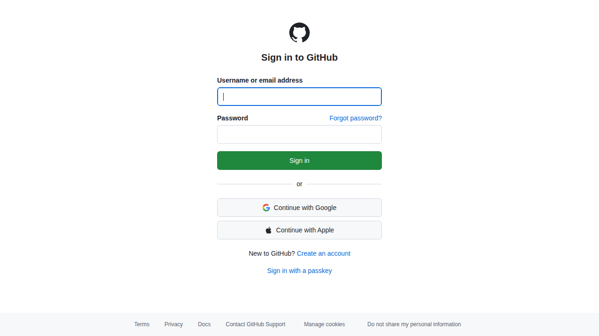

# Visited: https://github.com/codespaces/redesigned-invention-pqxv49qvp5gc75wg?editor=jupyter
**Time:** Tue May 12 07:22:36 UTC 2026

## Screenshot

## Raw HTML
[page.html](./page.html)

## Downloaded Media (4 files)
## Downloaded Media Files

## Other Links
- [#start-of-content](#start-of-content)
- [/manifest.json](/manifest.json)
- [/opensearch.xml](/opensearch.xml)
- [/password_reset](/password_reset)
- [/signup?return_to=https%3A%2F%2Fgithub.com%2Fcodespaces%2Fredesigned-invention-pqxv49qvp5gc75wg%3Feditor%3Djupyter&amp;source=login](/signup?return_to=https%3A%2F%2Fgithub.com%2Fcodespaces%2Fredesigned-invention-pqxv49qvp5gc75wg%3Feditor%3Djupyter&amp;source=login)
- [/u2f/login_fragment?disable_signup=false&amp;is_emu_login=false&amp;mobile_ios=false&amp;return_to=https%3A%2F%2Fgithub.com%2Fcodespaces%2Fredesigned-invention-pqxv49qvp5gc75wg%3Feditor%3Djupyter](/u2f/login_fragment?disable_signup=false&amp;is_emu_login=false&amp;mobile_ios=false&amp;return_to=https%3A%2F%2Fgithub.com%2Fcodespaces%2Fredesigned-invention-pqxv49qvp5gc75wg%3Feditor%3Djupyter)
- [https://avatars.githubusercontent.com](https://avatars.githubusercontent.com)
- [https://docs.github.com](https://docs.github.com)
- [https://docs.github.com/site-policy/github-terms/github-terms-of-service](https://docs.github.com/site-policy/github-terms/github-terms-of-service)
- [https://docs.github.com/site-policy/privacy-policies/github-privacy-statement](https://docs.github.com/site-policy/privacy-policies/github-privacy-statement)
- [https://github-cloud.s3.amazonaws.com](https://github-cloud.s3.amazonaws.com)
- [https://github.com/login](https://github.com/login)
- [https://github.githubassets.com](https://github.githubassets.com)
- [https://github.githubassets.com/](https://github.githubassets.com/)
- [https://github.githubassets.com/assets/19262-aea302dccbe6a81e.js](https://github.githubassets.com/assets/19262-aea302dccbe6a81e.js)
- [https://github.githubassets.com/assets/19930-11b17300f073690b.js](https://github.githubassets.com/assets/19930-11b17300f073690b.js)
- [https://github.githubassets.com/assets/26533-f22c29ae5e9b1ed2.js](https://github.githubassets.com/assets/26533-f22c29ae5e9b1ed2.js)
- [https://github.githubassets.com/assets/28839-7adfdde5afeb1a03.js](https://github.githubassets.com/assets/28839-7adfdde5afeb1a03.js)
- [https://github.githubassets.com/assets/2887-91b9c645d570616a.js](https://github.githubassets.com/assets/2887-91b9c645d570616a.js)
- [https://github.githubassets.com/assets/2966-d68f2b4558d86113.js](https://github.githubassets.com/assets/2966-d68f2b4558d86113.js)
- [https://github.githubassets.com/assets/31893-28d09ebc6561c46c.js](https://github.githubassets.com/assets/31893-28d09ebc6561c46c.js)
- [https://github.githubassets.com/assets/33805-da9f821452a32f15.js](https://github.githubassets.com/assets/33805-da9f821452a32f15.js)
- [https://github.githubassets.com/assets/34646-4c7883eb242d5210.js](https://github.githubassets.com/assets/34646-4c7883eb242d5210.js)
- [https://github.githubassets.com/assets/38522-34699575bde106e3.js](https://github.githubassets.com/assets/38522-34699575bde106e3.js)
- [https://github.githubassets.com/assets/41013-647932573fc130af.js](https://github.githubassets.com/assets/41013-647932573fc130af.js)
- [https://github.githubassets.com/assets/4244-97fb660009234136.js](https://github.githubassets.com/assets/4244-97fb660009234136.js)
- [https://github.githubassets.com/assets/46287-8c3fcf55b906a24b.js](https://github.githubassets.com/assets/46287-8c3fcf55b906a24b.js)
- [https://github.githubassets.com/assets/46740-5a373320e5ef9c01.js](https://github.githubassets.com/assets/46740-5a373320e5ef9c01.js)
- [https://github.githubassets.com/assets/46752-7bd8967216f7ea42.js](https://github.githubassets.com/assets/46752-7bd8967216f7ea42.js)
- [https://github.githubassets.com/assets/49521-3b553cd29062db6a.js](https://github.githubassets.com/assets/49521-3b553cd29062db6a.js)
- [https://github.githubassets.com/assets/51210-45dfb7dd106f6b96.js](https://github.githubassets.com/assets/51210-45dfb7dd106f6b96.js)
- [https://github.githubassets.com/assets/60481-24b13ea726837f7b.js](https://github.githubassets.com/assets/60481-24b13ea726837f7b.js)
- [https://github.githubassets.com/assets/61110-073153e0413daf3a.js](https://github.githubassets.com/assets/61110-073153e0413daf3a.js)
- [https://github.githubassets.com/assets/67466-79abcbf599986a00.js](https://github.githubassets.com/assets/67466-79abcbf599986a00.js)
- [https://github.githubassets.com/assets/71410-874f65a04c129aeb.js](https://github.githubassets.com/assets/71410-874f65a04c129aeb.js)
- [https://github.githubassets.com/assets/79039-69acf717ffc901a4.js](https://github.githubassets.com/assets/79039-69acf717ffc901a4.js)
- [https://github.githubassets.com/assets/79087-4f706db8aa2ec0fb.js](https://github.githubassets.com/assets/79087-4f706db8aa2ec0fb.js)
- [https://github.githubassets.com/assets/81058-fc9ccbdd06141af8.js](https://github.githubassets.com/assets/81058-fc9ccbdd06141af8.js)
- [https://github.githubassets.com/assets/81683-382ccc88e034ea1d.js](https://github.githubassets.com/assets/81683-382ccc88e034ea1d.js)
- [https://github.githubassets.com/assets/81730-7197e307b5dcca64.js](https://github.githubassets.com/assets/81730-7197e307b5dcca64.js)
- [https://github.githubassets.com/assets/82097-11971d9e2549fcf1.js](https://github.githubassets.com/assets/82097-11971d9e2549fcf1.js)
- [https://github.githubassets.com/assets/85924-f9b9156c785c7366.js](https://github.githubassets.com/assets/85924-f9b9156c785c7366.js)
- [https://github.githubassets.com/assets/86483-c3a819d46503a3da.js](https://github.githubassets.com/assets/86483-c3a819d46503a3da.js)
- [https://github.githubassets.com/assets/89627-40275597692dc855.js](https://github.githubassets.com/assets/89627-40275597692dc855.js)
- [https://github.githubassets.com/assets/90350-551d81ec6eef68a3.js](https://github.githubassets.com/assets/90350-551d81ec6eef68a3.js)
- [https://github.githubassets.com/assets/96232-540ff5f81016a9ca.js](https://github.githubassets.com/assets/96232-540ff5f81016a9ca.js)
- [https://github.githubassets.com/assets/99328-a2c6b180d25cb160.js](https://github.githubassets.com/assets/99328-a2c6b180d25cb160.js)
- [https://github.githubassets.com/assets/behaviors-b0ec4c6cbdda67ec.js](https://github.githubassets.com/assets/behaviors-b0ec4c6cbdda67ec.js)
- [https://github.githubassets.com/assets/dark-2d1fe43dbc9adf1f.css](https://github.githubassets.com/assets/dark-2d1fe43dbc9adf1f.css)
- [https://github.githubassets.com/assets/dark_colorblind-3ad0ec21150df75b.css](https://github.githubassets.com/assets/dark_colorblind-3ad0ec21150df75b.css)

## Stats
- Links: 90
- Media: 4
